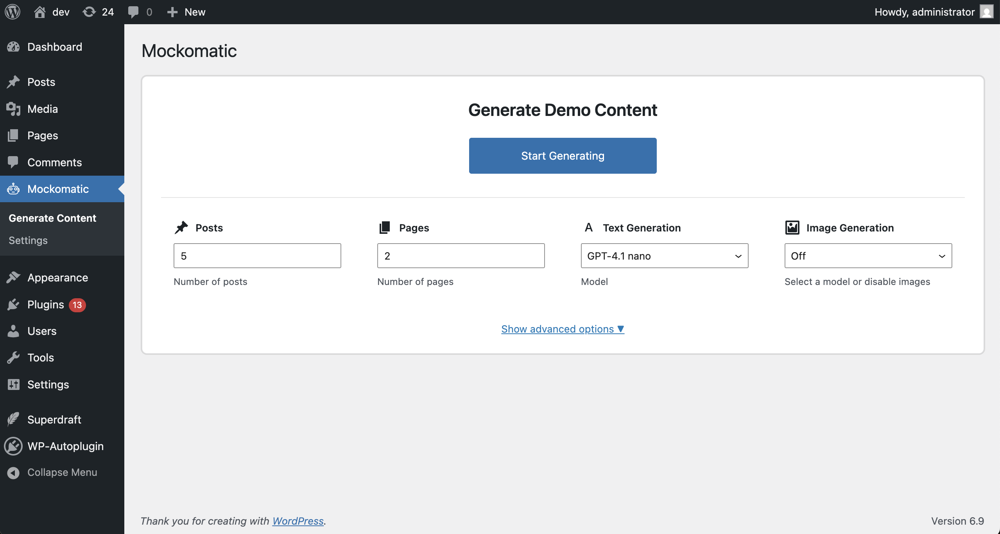
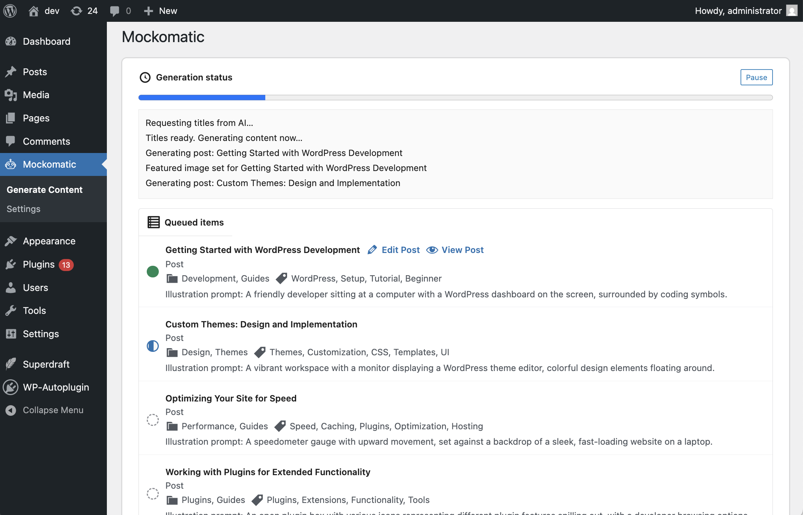
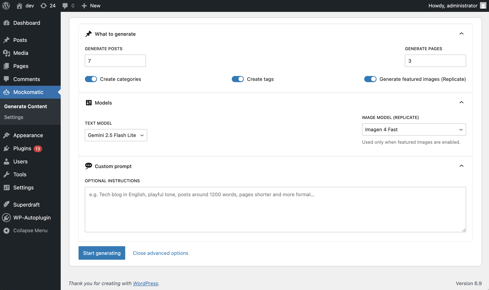
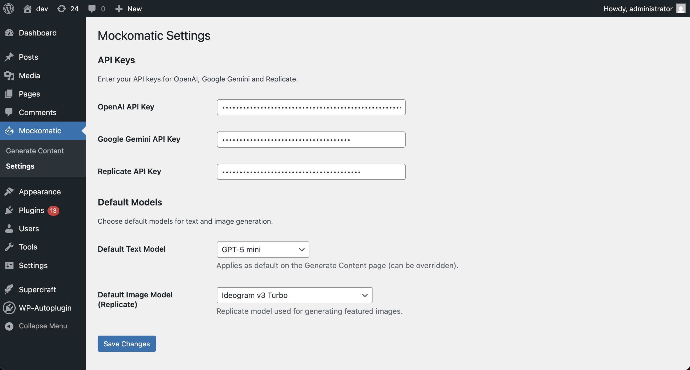

# Mockomatic

Mockomatic is a free WordPress plugin that auto-builds believable demo sites with AI. Generate posts, pages, categories, tags, and even featured images in one run using your own OpenAI, Google Gemini, or Replicate API keys. Clean, native-like UI inside wp-admin; no upsells, no middlemen, just fast content seeding for prototypes and staging sites.

- Spin up posts and pages with rich Gutenberg block markup
- Create categories, tags, and featured images alongside the content
- Choose between OpenAI and Google Gemini text models; Replicate for images
- Guided prompts for titles, content, taxonomy, and illustration ideas
- Progress-aware UI with stop/resume-friendly handling and inline links to edit results

[▼ **Jump to Usage**](#usage-examples)

## Plugin Highlights

- **One-click site scaffolding**: Request any mix of posts/pages; Mockomatic handles text, taxonomies, and featured images in a single flow.
- **Native admin experience**: Lives under the `Mockomatic` menu in wp-admin with Gutenberg-like controls and progress logs.
- **Bring your own keys**: Store OpenAI, Google Gemini, and Replicate API keys in settings—no proxies or extra fees.
- **Structured Gutenberg output**: Generates valid block markup (paragraphs, headings, lists, quotes, columns, buttons, etc.) ready for immediate editing.
- **Taxonomy + media aware**: Suggests categories/tags and (optionally) saves AI-generated featured images to the Media Library.

## Features

### AI Content Generation
- Generate titles and full Gutenberg block content for posts and pages from a single prompt.
- Auto-assign categories and tags, with smart defaults that keep site structure coherent.
- Per-run controls for counts, models, taxonomy creation, and illustration prompts.

### Featured Images (Replicate)
- Optional featured image generation per post via Replicate.
- Choose from multiple state-of-the-art image models; images are uploaded and attached automatically.

### Flexible Prompts
- Global instructions to set tone, language, or domain (e.g., SaaS landing pages, travel blog, agency site).
- Inline illustration descriptions per post to guide featured image style.

### Progress & Control
- Live progress meter and log of every action.
- Stop generation mid-run without breaking already-created content.
- Quick links back to the WordPress editor for each generated item.

## Installation

1. Download or clone this repository into `/wp-content/plugins/`:
   ```bash
   git clone https://github.com/WP-Autoplugin/mockomatic.git
   ```
2. Activate **Mockomatic** from the **Plugins** menu in WordPress.
3. Go to **Mockomatic → Settings** and enter your API keys (OpenAI, Google Gemini, Replicate).
4. Optional: Set default text and image models for future runs.

## Usage Examples

### Generate a Batch of Posts and Pages
1. Open **Mockomatic → Generate Content**.
2. Set how many posts and pages you need.
3. Pick a text model (OpenAI or Gemini) and optionally enable featured images with a Replicate model.
4. Add optional instructions (e.g., "minimalist tech blog in English; posts ~1,200 words; pages concise and formal").
5. Click **Start Generating**. Watch the log for each created item and jump to **Edit** links as they appear.

### Create Taxonomy and Images Together
1. Enable **Create categories**, **Create tags**, and **Generate featured images**.
2. Provide a style cue for images in your instructions (or per-item illustration prompts when available).
3. Run generation; Mockomatic will insert posts, attach featured images, and assign new categories/tags automatically.

### Iterate with Custom Prompts
1. Use the **Custom prompt** box to steer tone, structure, or topics (e.g., "local bakery site; warm, friendly tone; add pricing blocks and calls to action").
2. Re-run generation with different counts or models to seed multiple variants of demo content.

## Screenshots & Demo

<details open>
<summary>Generate demo content inside wp-admin</summary>


</details>

<details>
<summary>Live progress log and task list</summary>


</details>

<details>
<summary>AI model and prompt configuration</summary>


</details>

<details>
<summary>Settings page for API keys and defaults</summary>


</details>

## Requirements

- WordPress 6.0+
- PHP 7.4+
- API keys for any providers you plan to use (OpenAI, Google Gemini, Replicate)
- Media uploads enabled if you plan to generate featured images

## Supported AI Models

**Text (OpenAI):** `gpt-5.1`, `gpt-5`, `gpt-5-mini`, `gpt-5-nano`, `gpt-5-chat-latest`, `gpt-4.5-preview`, `gpt-4.1`, `gpt-4.1-mini`, `gpt-4.1-nano`, `gpt-4o`, `gpt-4o-mini`, `chatgpt-4o-latest`  
**Text (Google Gemini/Gemma):** `gemini-3-pro-preview`, `gemini-2.5-pro`, `gemini-2.5-flash`, `gemini-2.5-flash-lite`, `gemma-3-27b-it`  
**Images (Replicate):** `google/nano-banana-pro`, `google/gemini-2.5-flash-image`, `google/imagen-4`, `google/imagen-4-ultra`, `google/imagen-4-fast`, `google/imagen-3`, `google/imagen-3-fast`, `black-forest-labs/flux-1.1-pro`, `black-forest-labs/flux-dev`, `black-forest-labs/flux-schnell`, `black-forest-labs/flux-pro`, `recraft-ai/recraft-v3`, `ideogram-ai/ideogram-v3-turbo`, `ideogram-ai/ideogram-v3-quality`, `ideogram-ai/ideogram-v3-balanced`, `bytedance/seedream-4.5`

## Contributing

Pull requests and issues are welcome. Please follow WordPress coding standards and keep admin UX native and minimal.

## License

GPL-2.0 or later — https://www.gnu.org/licenses/gpl-2.0.html
